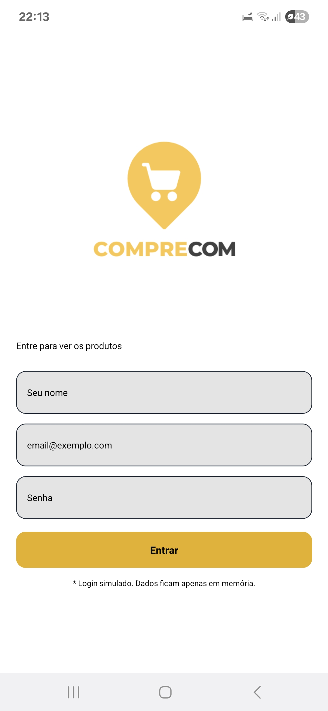
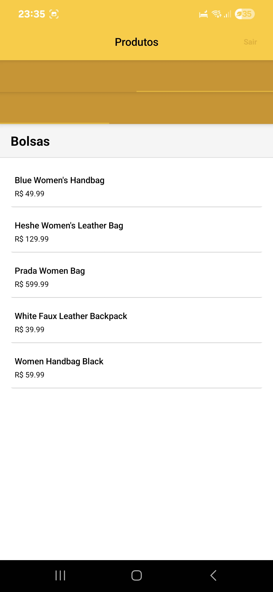
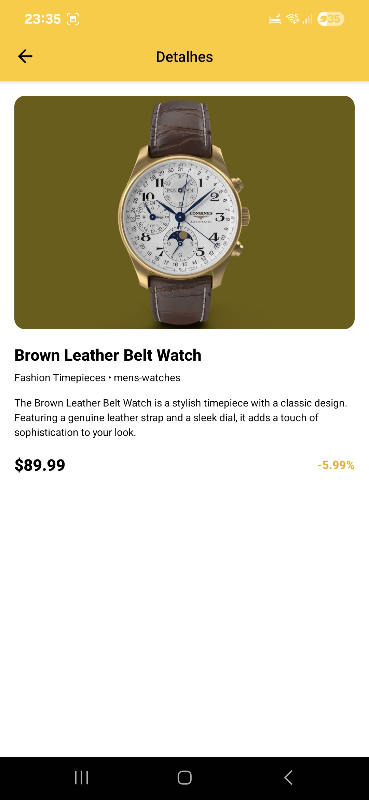

```md
# CompreCom (Expo + React Native + Axios + Redux Toolkit)

App demo para listagem de produtos por categoria com abas (masculino/feminino), detalhes por ID e login simulado.

## Requisitos atendidos
- **Login** com validação (nome, email e senha) e armazenamento temporário via **Redux Toolkit**.
- **Lista por categoria** consumindo API real (`https://dummyjson.com/products/category/{categoria}`) usando **Axios**.
- **Abas** separando categorias masculinas e femininas.
- **Detalhes do produto** por ID (`/products/{id}`) com nome, imagem, descrição, preço e desconto.
- **Logout** que limpa store e volta para a tela de login.
- **Boas práticas**: estrutura em `src/`, separação de componentes, serviços, store e telas; loading/errors; navegação clara.

## Stack
- React Native (Expo)
- Axios
- @reduxjs/toolkit + react-redux
- React Navigation (Stack + Material Top Tabs)

## Como rodar
```bash
# 1) Requisitos: Node LTS, Expo CLI (npx usa automático), Android/iOS emulator ou Expo Go no celular

# 2) Instale deps
npm install
# ou yarn

# 3) Inicie
npx expo start --tunnel
# depois leia o QR no Expo Go ou rode em emulador - Versão Android SDK 51 (https://expo.dev/go?sdkVersion=51&platform=android&device=true)

```

## Estrutura
```
src/
  components/       # componentes reutilizáveis (ProductCard)
  screens/          # telas (Login, Abas, Categoria, Detalhes)
  services/         # axios e chamadas à API
  store/            # Redux Toolkit slices (auth, products)
  navigation/       # navegação stack e abas
  theme/            # cores e tokens de estilo
  img/              # imagens adicionadas localmente
```

## Capturas de Tela
```





---
